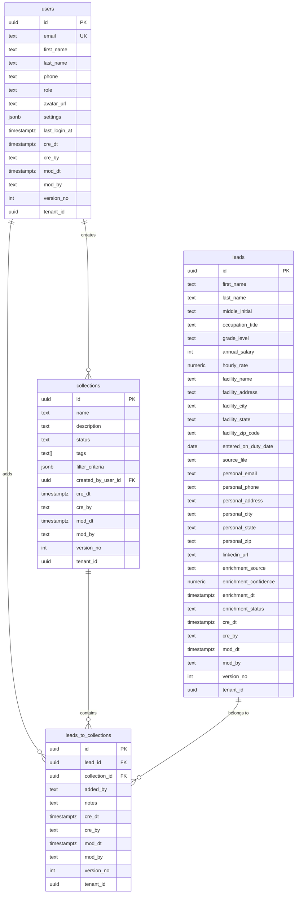

# FEDSafe Retirement — Database Schema

> **Version:** 1.0 · **Date:** 2026-04-01 · **Engine:** Supabase (PostgreSQL) · **Project ID:** `gqarlkfmpgaotbezpkbs`

---

## 1. Design Principles

### 1.1 NON-NEGOTIABLE: Audit Fields on ALL Tables

Every table **MUST** include these 6 control/audit columns:

| Column | Type | Default | Description |
|--------|------|---------|-------------|
| `cre_dt` | `timestamptz` | `now()` | Record creation timestamp |
| `cre_by` | `text` | `''` | User ID/email who created the record |
| `mod_dt` | `timestamptz` | `now()` | Last modification timestamp |
| `mod_by` | `text` | `''` | User ID/email who last modified |
| `version_no` | `integer` | `1` | Optimistic concurrency version counter |
| `tenant_id` | `uuid` | `NULL` | Multi-tenancy partition key (reserved) |

> [!CAUTION]
> **No exceptions.** Every migration creating or altering a table MUST include these fields. This applies to junction/bridge tables as well.

### 1.2 Primary Keys

- **ALL tables use UUID primary keys** (`gen_random_uuid()`)
- Column name: `id` (type `uuid`, `DEFAULT gen_random_uuid()`, `PRIMARY KEY`)
- No serial/auto-increment IDs

### 1.3 Naming Conventions

- Tables: `snake_case`, plural (e.g., `leads`, `collections`, `users`)
- Columns: `snake_case`
- Foreign keys: `<referenced_table_singular>_id` (e.g., `lead_id`, `collection_id`)
- Indexes: `idx_<table>_<column(s)>`
- Constraints: `fk_<table>_<referenced_table>`, `uq_<table>_<column>`

---

## 2. Schema Diagram



---

## 3. Table Definitions

### 3.1 `users`

Application users (synced with Supabase Auth). The `settings` JSONB column stores all persistent user preferences.

```sql
CREATE TABLE public.users (
    id                uuid        DEFAULT gen_random_uuid() PRIMARY KEY,
    email             text        NOT NULL UNIQUE,
    first_name        text        NOT NULL DEFAULT '',
    last_name         text        NOT NULL DEFAULT '',
    phone             text        DEFAULT '',
    role              text        NOT NULL DEFAULT 'viewer'
                                  CHECK (role IN ('admin', 'advisor', 'viewer')),
    avatar_url        text        DEFAULT '',
    settings          jsonb       DEFAULT '{
        "theme_mode": "system",
        "default_page_size": 25,
        "default_columns": [],
        "sidebar_collapsed": false,
        "notifications_enabled": true
    }'::jsonb,
    last_login_at     timestamptz,

    -- Audit fields (NON-NEGOTIABLE)
    cre_dt            timestamptz DEFAULT now() NOT NULL,
    cre_by            text        DEFAULT '' NOT NULL,
    mod_dt            timestamptz DEFAULT now() NOT NULL,
    mod_by            text        DEFAULT '' NOT NULL,
    version_no        integer     DEFAULT 1 NOT NULL,
    tenant_id         uuid
);

-- Indexes
CREATE INDEX idx_users_email ON public.users (email);
CREATE INDEX idx_users_role ON public.users (role);
CREATE INDEX idx_users_tenant_id ON public.users (tenant_id);
```

**Seed Data:**

```sql
INSERT INTO public.users (email, first_name, last_name, phone, role, cre_by, mod_by)
VALUES (
    'rgarcia350@gmail.com',
    'Ricardo',
    'Garcia',
    '(703) 475-3098',
    'admin',
    'system_seed',
    'system_seed'
);
```

### 3.2 `leads`

Federal employee records imported from FOIA data. Each row from the Excel source gets a UUID PK.

```sql
CREATE TABLE public.leads (
    id                    uuid        DEFAULT gen_random_uuid() PRIMARY KEY,
    first_name            text        NOT NULL DEFAULT '',
    last_name             text        NOT NULL DEFAULT '',
    middle_initial        text        DEFAULT '',
    occupation_title      text        DEFAULT '',
    grade_level           text        DEFAULT '',
    annual_salary         integer     DEFAULT 0,
    hourly_rate           numeric(10,2) DEFAULT 0,
    facility_name         text        DEFAULT '',
    facility_address      text        DEFAULT '',
    facility_city         text        DEFAULT '',
    facility_state        text        DEFAULT '',
    facility_zip_code     text        DEFAULT '',
    entered_on_duty_date  date,
    source_file           text        DEFAULT '',

    -- Enrichment fields (populated by third-party providers: Apollo, ZoomInfo, etc.)
    personal_email        text,
    personal_phone        text,
    personal_address      text,
    personal_city         text,
    personal_state        text,
    personal_zip          text,
    linkedin_url          text,
    enrichment_source     text,
    enrichment_confidence numeric(3,2),
    enrichment_dt         timestamptz,
    enrichment_status     text        DEFAULT 'pending'
                                      CHECK (enrichment_status IN ('pending', 'enriched', 'partial', 'not_found', 'error')),

    -- Full-text search vector (auto-populated by trigger)
    search_vector         tsvector,

    -- Audit fields (NON-NEGOTIABLE)
    cre_dt                timestamptz DEFAULT now() NOT NULL,
    cre_by                text        DEFAULT '' NOT NULL,
    mod_dt                timestamptz DEFAULT now() NOT NULL,
    mod_by                text        DEFAULT '' NOT NULL,
    version_no            integer     DEFAULT 1 NOT NULL,
    tenant_id             uuid
);

-- Performance indexes for search/filter
CREATE INDEX idx_leads_last_name ON public.leads (last_name);
CREATE INDEX idx_leads_facility_state ON public.leads (facility_state);
CREATE INDEX idx_leads_grade_level ON public.leads (grade_level);
CREATE INDEX idx_leads_occupation_title ON public.leads (occupation_title);
CREATE INDEX idx_leads_annual_salary ON public.leads (annual_salary);
CREATE INDEX idx_leads_entered_on_duty ON public.leads (entered_on_duty_date);
CREATE INDEX idx_leads_facility_city ON public.leads (facility_city);
CREATE INDEX idx_leads_facility_zip ON public.leads (facility_zip_code);
CREATE INDEX idx_leads_tenant_id ON public.leads (tenant_id);

-- Full-text search index (GIN)
CREATE INDEX idx_leads_search_vector ON public.leads USING GIN (search_vector);

-- Composite index for common filter combos
CREATE INDEX idx_leads_state_salary ON public.leads (facility_state, annual_salary);
CREATE INDEX idx_leads_state_grade ON public.leads (facility_state, grade_level);
```

### Full-Text Search Trigger

```sql
-- Function to auto-update search_vector
CREATE OR REPLACE FUNCTION leads_search_vector_update() RETURNS trigger AS $$
BEGIN
    NEW.search_vector :=
        to_tsvector('english',
            coalesce(NEW.first_name, '') || ' ' ||
            coalesce(NEW.last_name, '') || ' ' ||
            coalesce(NEW.middle_initial, '') || ' ' ||
            coalesce(NEW.occupation_title, '') || ' ' ||
            coalesce(NEW.facility_name, '') || ' ' ||
            coalesce(NEW.facility_city, '') || ' ' ||
            coalesce(NEW.facility_state, '') || ' ' ||
            coalesce(NEW.facility_zip_code, '')
        );
    RETURN NEW;
END;
$$ LANGUAGE plpgsql;

CREATE TRIGGER trg_leads_search_vector
    BEFORE INSERT OR UPDATE ON public.leads
    FOR EACH ROW EXECUTE FUNCTION leads_search_vector_update();
```

### 3.3 `collections`

Named groups of leads (campaigns) for outreach purposes.

```sql
CREATE TABLE public.collections (
    id                  uuid        DEFAULT gen_random_uuid() PRIMARY KEY,
    name                text        NOT NULL,
    description         text        DEFAULT '',
    status              text        DEFAULT 'active'
                                    CHECK (status IN ('active', 'archived', 'draft')),
    tags                text[]      DEFAULT '{}',
    filter_criteria     jsonb       DEFAULT '{}'::jsonb,
    created_by_user_id  uuid        REFERENCES public.users(id) ON DELETE SET NULL,

    -- Audit fields (NON-NEGOTIABLE)
    cre_dt              timestamptz DEFAULT now() NOT NULL,
    cre_by              text        DEFAULT '' NOT NULL,
    mod_dt              timestamptz DEFAULT now() NOT NULL,
    mod_by              text        DEFAULT '' NOT NULL,
    version_no          integer     DEFAULT 1 NOT NULL,
    tenant_id           uuid
);

CREATE INDEX idx_collections_status ON public.collections (status);
CREATE INDEX idx_collections_created_by ON public.collections (created_by_user_id);
CREATE INDEX idx_collections_tenant_id ON public.collections (tenant_id);
```

### 3.4 `leads_to_collections` (Junction Table)

Maps leads to collections (many-to-many). A lead can be in multiple collections.

```sql
CREATE TABLE public.leads_to_collections (
    id              uuid        DEFAULT gen_random_uuid() PRIMARY KEY,
    lead_id         uuid        NOT NULL REFERENCES public.leads(id) ON DELETE CASCADE,
    collection_id   uuid        NOT NULL REFERENCES public.collections(id) ON DELETE CASCADE,
    added_by        text        DEFAULT '',
    notes           text        DEFAULT '',

    -- Audit fields (NON-NEGOTIABLE)
    cre_dt          timestamptz DEFAULT now() NOT NULL,
    cre_by          text        DEFAULT '' NOT NULL,
    mod_dt          timestamptz DEFAULT now() NOT NULL,
    mod_by          text        DEFAULT '' NOT NULL,
    version_no      integer     DEFAULT 1 NOT NULL,
    tenant_id       uuid,

    -- Prevent duplicate lead-collection pairs
    CONSTRAINT uq_lead_collection UNIQUE (lead_id, collection_id)
);

CREATE INDEX idx_l2c_lead_id ON public.leads_to_collections (lead_id);
CREATE INDEX idx_l2c_collection_id ON public.leads_to_collections (collection_id);
CREATE INDEX idx_l2c_tenant_id ON public.leads_to_collections (tenant_id);
```

---

## 4. Auto-Update `mod_dt` Trigger

Applied to ALL tables to auto-set `mod_dt` on updates:

```sql
CREATE OR REPLACE FUNCTION update_mod_dt() RETURNS trigger AS $$
BEGIN
    NEW.mod_dt = now();
    NEW.version_no = OLD.version_no + 1;
    RETURN NEW;
END;
$$ LANGUAGE plpgsql;

-- Apply to each table
CREATE TRIGGER trg_users_mod_dt
    BEFORE UPDATE ON public.users
    FOR EACH ROW EXECUTE FUNCTION update_mod_dt();

CREATE TRIGGER trg_leads_mod_dt
    BEFORE UPDATE ON public.leads
    FOR EACH ROW EXECUTE FUNCTION update_mod_dt();

CREATE TRIGGER trg_collections_mod_dt
    BEFORE UPDATE ON public.collections
    FOR EACH ROW EXECUTE FUNCTION update_mod_dt();

CREATE TRIGGER trg_l2c_mod_dt
    BEFORE UPDATE ON public.leads_to_collections
    FOR EACH ROW EXECUTE FUNCTION update_mod_dt();
```

---

## 5. Row-Level Security (RLS)

```sql
-- Enable RLS on all tables
ALTER TABLE public.users ENABLE ROW LEVEL SECURITY;
ALTER TABLE public.leads ENABLE ROW LEVEL SECURITY;
ALTER TABLE public.collections ENABLE ROW LEVEL SECURITY;
ALTER TABLE public.leads_to_collections ENABLE ROW LEVEL SECURITY;

-- Policies (initial — allow authenticated users)
CREATE POLICY "Users can read own profile"
    ON public.users FOR SELECT
    USING (auth.uid()::text = id::text OR
           EXISTS (SELECT 1 FROM public.users u WHERE u.id::text = auth.uid()::text AND u.role = 'admin'));

CREATE POLICY "Authenticated users can read leads"
    ON public.leads FOR SELECT
    USING (auth.role() = 'authenticated');

CREATE POLICY "Authenticated users can read collections"
    ON public.collections FOR SELECT
    USING (auth.role() = 'authenticated');

CREATE POLICY "Authenticated users can manage own collections"
    ON public.collections FOR ALL
    USING (auth.uid()::text = created_by_user_id::text OR
           EXISTS (SELECT 1 FROM public.users u WHERE u.id::text = auth.uid()::text AND u.role = 'admin'));

CREATE POLICY "Authenticated users can manage leads_to_collections"
    ON public.leads_to_collections FOR ALL
    USING (auth.role() = 'authenticated');
```

---

## 6. Data Import Strategy

The 472,576 records from the FOIA Excel file will be imported via a **Node.js/Python batch script**:

1. Read Excel with `xlsx` or `pandas`
2. Transform column names to snake_case
3. Generate UUID for each row
4. Batch insert in chunks of 1,000 rows using Supabase `upsert`
5. Set `source_file` = `'FOIA_2025_PO_REVISED'`
6. Set `cre_by` = `'data_import'`
7. Progress logging after every 10,000 rows

**Estimated import time:** ~15-30 minutes (depends on network)

---

## 7. Performance Considerations

| Concern | Solution |
|---------|----------|
| 472K rows in `leads` | Server-side pagination via Supabase `.range()` |
| Full-text search | GIN index on `search_vector` tsvector column |
| Filter combos | Composite indexes on common pairs (state+salary, state+grade) |
| Counts | Consider materialized views for dashboard KPIs |
| Junction table growth | Indexes on both FK columns |

---

## 8. Future Tables (Reserved)

| Table | Purpose |
|-------|---------|
| `activity_log` | Track user actions (search, export, add to collection) |
| `data_imports` | Track import jobs (file, row count, status, errors) |
| `notifications` | In-app notification system |
| `saved_searches` | Persist user filter presets |
