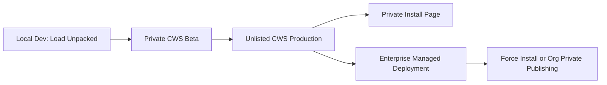

# 01 — Deployment Strategy

## Recommended Strategy

For VentureSoft private extensions, especially the ACT.com / FedSafeRetirement extension, use this model:

## Why Not Direct `.crx` Distribution?

Direct CRX distribution is fragile for normal business users. Chrome expects Chrome Web Store distribution for typical Windows and macOS extension installs. Enterprise policy deployment can support managed installation, but for most clients the Chrome Web Store is the clean path.

## Channel Selection

| Channel | Who Uses It | Chrome Web Store Visibility | Purpose |
|---|---:|---:|---|
| Dev | Ricardo / Claude / internal dev machine | None | Local testing with `Load unpacked` |
| Beta | FedSafeRetirement pilot users, trusted testers | Private | Controlled testing before public-ish rollout |
| Production | Licensed clients | Unlisted | Install by private link, license-gated in backend |
| Enterprise | Managed Chrome / Google Workspace customers | Private org or managed policy | Admin-controlled rollout |

## Recommended Listings

Create two Chrome Web Store items:

1. **ACT Copilot Beta**
   - Visibility: Private
   - Audience: trusted testers / Google Group
   - Separate extension ID
   - Lower version channel

2. **ACT Copilot**
   - Visibility: Unlisted
   - Audience: production clients with install link
   - Server-side license required before any premium feature works

A single listing can be moved from Private to Unlisted later, but two listings are better if ongoing beta testing will continue.

## Security Principle

The Chrome Web Store URL is not a security boundary.

Real security is enforced by:

- Server-side license validation.
- Tenant/database identity matching.
- User allowlist or seat assignment.
- Feature flags from backend.
- Short-lived signed session token.
- Server-side audit logging.
