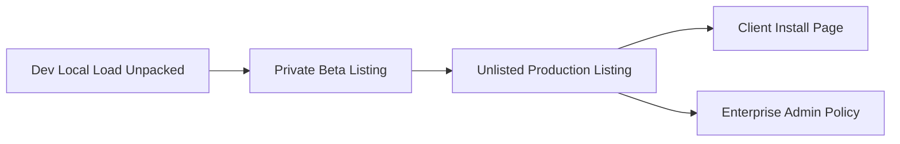

# 04 — Release Channels

## Channel Model



## Dev Channel

Use Chrome:

```text
chrome://extensions → Developer mode → Load unpacked
```

Purpose:

- Local testing.
- DOM selector validation.
- ACT page detection.
- License handshake debugging.
- UI iteration.

## Beta Channel

Chrome Web Store visibility:

```text
Private
```

Access control:

```text
Trusted testers and/or Google Group
```

Purpose:

- FedSafeRetirement pilot.
- Controlled ACT database validation.
- UX feedback.
- Store review readiness.

## Production Channel

Chrome Web Store visibility:

```text
Unlisted
```

Access control:

```text
Backend license check
```

Install flow:

```text
Customer receives private install page link
↓
Install from Chrome Web Store unlisted URL
↓
Extension opens onboarding/login
↓
Backend validates tenant/user/database/license
↓
Feature flags enable allowed UI
```

## Enterprise Channel

Options:

1. Chrome Enterprise force install using extension ID and update URL.
2. Google Workspace private domain publishing.
3. External organization private publishing where the customer admin approves VentureSoft as publisher.

Use this when:

- The client has managed Chrome.
- IT wants centralized deployment.
- Users should not manually install the extension.
- Users should not be able to remove the extension.

## Rollback Strategy

Extension rollback is mostly controlled by publishing a newer fixed version.

Backend feature flags should support emergency shutdown:

```json
{
  "global_kill_switch": false,
  "tenant_kill_switch": false,
  "disable_ai_features": false,
  "disable_dom_write_actions": false,
  "read_only_mode": true
}
```

## Recommended Release Names

```text
v0.1.0  Internal prototype
v0.2.0  FedSafe private beta
v0.3.0  Store-ready beta
v1.0.0  First production unlisted release
v1.1.0  Enterprise deployment ready
```
