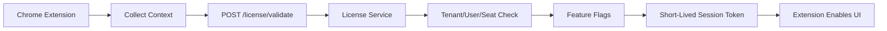

# 05 — License Handshake Architecture

## Core Principle

The extension is not trusted. The backend is the licensing authority.

The extension may display UI, collect page context, and call APIs, but it must never decide premium access by itself.

## License Handshake Flow



## Inputs From Extension

The extension sends non-secret identity/context values:

```json
{
  "extension_id": "chrome-extension-id",
  "extension_version": "0.2.0",
  "channel": "beta",
  "install_id": "generated-uuid-from-chrome-storage-local",
  "user_email": "user@example.com",
  "platform": "act",
  "page_origin": "https://app.act.com",
  "act_database_id": "customer-act-db-id",
  "act_database_name": "FedSafeRetirement",
  "tenant_hint": "fedsafe",
  "browser": "Chrome",
  "timestamp_utc": "2026-05-15T00:00:00Z"
}
```

## Backend Response

The backend returns allowed state only:

```json
{
  "licensed": true,
  "tenant_id": "uuid",
  "customer_name": "FedSafeRetirement",
  "seat_id": "uuid",
  "session_token": "short-lived-signed-token",
  "expires_at_utc": "2026-05-15T13:00:00Z",
  "features": {
    "copilot_drawer": true,
    "letter_ai_templates": true,
    "ai_rules": true,
    "dom_write_actions": false,
    "admin_tools": false
  },
  "limits": {
    "daily_ai_calls": 100,
    "max_templates": 250
  },
  "messages": []
}
```

## Failure Response

```json
{
  "licensed": false,
  "reason_code": "USER_NOT_ASSIGNED",
  "safe_message": "This browser user is not assigned to an active ACT Copilot license.",
  "features": {
    "copilot_drawer": false,
    "letter_ai_templates": false,
    "ai_rules": false,
    "dom_write_actions": false,
    "admin_tools": false
  }
}
```

## Backend Tables

Recommended tables:

```text
tenants
extension_products
extension_store_items
extension_installs
extension_licenses
extension_seats
extension_license_events
extension_feature_flags
extension_allowed_domains
extension_supported_platforms
```

All tables must include:

```text
primary key UUID
created_at
created_by
updated_at
updated_by
version
deleted
```

Tenant-aware tables must include:

```text
tenant_id UUID
```

## ACT Credential Constraint

Do not expose ACT credentials in the extension.

The backend handles:

- ACT username/password/token exchange if required.
- Secure token storage.
- API calls to ACT.
- Refresh/renewal logic.

The extension should only receive short-lived session claims and feature flags.

## License Keys

Avoid static license keys pasted into the extension.

Better:

1. User installs extension.
2. User signs in or is identified by managed tenant context.
3. Extension sends context to backend.
4. Backend validates tenant/user/seat/database.
5. Backend returns short-lived token and feature flags.

## Kill Switches

Backend should support:

```text
global kill switch
tenant kill switch
extension version blocklist
minimum allowed version
feature disablement
read-only mode
```

## Logging

Log every license check:

```text
request_id
timestamp_utc
extension_id
extension_version
install_id
user_email_hash
platform
tenant_id
act_database_id
licensed result
reason_code
ip hash/user-agent
```

Avoid storing unnecessary page content or personal client data in logs.
