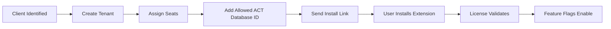

# 09 — Client Onboarding SOP

## Client Onboarding Flow



## Internal Tenant Setup

For each client create:

```text
tenant record
allowed ACT database ID/name
allowed domains
license plan
seat count
admin user
support contact
feature flag profile
```

## FedSafeRetirement Beta Setup

Recommended starting values:

```text
tenant_key: fedsafe
customer_name: FedSafeRetirement
platform: act
channel: beta
license_plan: pilot
features: copilot_drawer, templates, ai_rules read-only
write_actions: disabled initially
```

## User Seat Setup

For each user:

```text
user email
name
role
seat status
allowed platform
allowed database id
feature profile
```

## Install Instructions For Users

Send a clean email:

```text
Subject: Install ACT Copilot Beta

1. Open Chrome using your work Google account.
2. Click the private Chrome Web Store install link.
3. Install ACT Copilot Beta.
4. Open ACT.com.
5. Look for the ACT Copilot icon/drawer.
6. If prompted, sign in with your approved email.
7. Report issues to support@venturesoftllc.com.
```

## Support Intake Questions

When user reports issue:

```text
Chrome version
Extension version
User email
ACT database name/id if visible
Screenshot of issue if no sensitive data
Time of issue
What page they were on
What action they expected
```

## Disable User

To disable access:

1. Mark seat inactive in backend.
2. License check returns `licensed=false`.
3. Extension hides premium UI.
4. Audit event records access denial.

No extension reinstall required.

## Client Exit

To offboard a client:

```text
Disable tenant license
Disable all seats
Revoke tokens
Turn on tenant kill switch
Archive audit logs per retention policy
```
